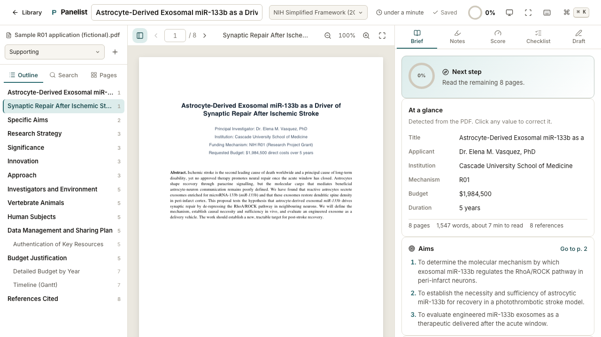

# Panelist

**A private, browser-based workbench for grant peer reviewers.**

You have been asked to review a grant application. The funding agency sent you a
PDF. Panelist is where you read it, mark it up, score it against your agency's
rubric, and leave with a critique that is already written.

Everything runs in your browser. The application PDF never leaves your machine:
there is no server, no upload, no account. That matters, because most agencies
treat applications as confidential and prohibit uploading them to third-party
services, including generative-AI tools.



## Why it exists

Reviewing a grant well is slow, exacting work. You read forty pages closely,
hold a dozen judgements in your head, keep every criticism tethered to the place
in the text that provoked it, and then assemble all of it into structured,
constructive comments under the criteria your agency defines. Panelist takes the
mechanical weight off that process so your attention stays on the science.

## What it does

- **Reads the PDF in the browser.** Drop in the application (and any supporting
  documents) and start reading immediately, with a crisp text layer, search, an
  auto-detected section outline, and a page map that tracks what you have read.
  Mixed portrait and landscape pages (budget tables, Gantt charts) each fit the
  width, and non-embedded standard fonts render correctly.
- **Detects the essentials.** Title, applicant, institution, mechanism, budget,
  duration, the specific aims, the key vocabulary, and counts of figures,
  tables, and references, all pulled from the text and editable.
- **Turns reading into evidence.** Select any passage and press **S**, **W**,
  **Q**, or **N** to tag it a strength, weakness, question, or note. Each tag
  becomes a highlight in the PDF and a bullet in your draft, carrying its page
  reference. Notes attach to the criterion the section belongs to.
- **Scores the way your agency does.** Built-in frameworks for **NIH** (2025
  simplified and the legacy five criteria), **NSF**, **CIHR**, **ERC**,
  **Horizon Europe**, **NSERC Discovery**, **NHMRC Ideas**, **Wellcome**,
  **UKRI/MRC**, and **DFG**, plus a general rubric, each with its scale, guiding
  questions, and an overall rating. A consistency check flags when your overall
  score drifts from your criterion scores.
- **Works for any agency.** Open *Manage frameworks…* from the framework menu to
  define your own criteria and scales, or duplicate a built-in rubric and edit
  it. Custom frameworks are stored in the browser and can be exported as JSON to
  share with co-reviewers. Many foundations and institutional competitions do
  not match a national agency's template; this is how you review those.
- **Keeps you honest with a checklist.** Completeness and rigor checks (power
  analysis, blinding, sex as a biological variable, data sharing, ethics, and
  more) show page references to where the application seems to address each item,
  so you verify rather than hunt. It includes reviewer self-checks such as
  conflict of interest.
- **Shows where you stand.** A live scorecard summarises every criterion, its
  score, and its evidence at a glance, and a *Before you submit* check lists the
  blockers that remain and the thoroughness nudges that make for a balanced,
  constructive critique (an unbalanced criterion, a major weakness with no
  suggested fix, an unconfirmed conflict of interest).
- **Writes the review.** Scores, rationale, and tagged evidence assemble into a
  structured critique with a preview, exportable as **Word (.docx)**,
  **Markdown**, plain text, or **print/PDF**. Confidential comments to the
  program stay separate and are excluded unless you opt in.
- **Saves as you go, privately.** Everything persists in the browser
  (IndexedDB). A JSON backup bundles the review and its PDFs so you can move to
  another machine.
- **Gets out of your way.** A command palette (**⌘K**), full keyboard control,
  focus mode, and light or dark themes.

## Privacy

Panelist is a static site with no backend. Your PDFs and notes are stored only
in your browser and are never transmitted anywhere. Clearing site data or using
a private window removes them, so use the JSON backup to keep a copy.

## Keyboard shortcuts

| Key | Action |
| --- | --- |
| `S` `W` `Q` `N` | Tag the selection as a strength, weakness, question, or note |
| `1`–`5` | Brief, Notes, Score, Checklist, Draft |
| `[` `]` | Previous / next page |
| `+` `-` | Zoom |
| `⌘F` | Find in document |
| `\` | Toggle the navigator |
| `F` | Focus mode |
| `⌘K` | Command palette |
| `?` | All shortcuts |

## Development

```bash
npm install
npm run dev          # start the dev server
npm run build        # typecheck and build for production
npm run preview      # serve the production build
npm test             # unit tests (Vitest)
npm run test:e2e     # end-to-end tests (Playwright)
```

The end-to-end tests drive the real app against a bundled, fictional sample
application (which includes a landscape budget page) and verify PDF rendering,
scrolling and page navigation, fact detection, tagging, scoring, the checklist,
custom frameworks, and export.

### Stack

React 19, TypeScript, Vite, Zustand, Dexie (IndexedDB), pdf.js for rendering,
and the `docx` library for Word export. No network calls at runtime.

### The sample application

`public/sample-application.pdf` is a fully fictional NIH R01 application,
generated by `scripts/make_sample_pdf.py`. It is written to exercise the app's
heuristics and contains no real research or personal data.

## Deployment

The app is a static bundle in `dist/`. The included GitHub Actions workflow
builds it and deploys to GitHub Pages, setting the correct base path for a
project site automatically.

## License

MIT. The application content you review is your own and stays on your device.
